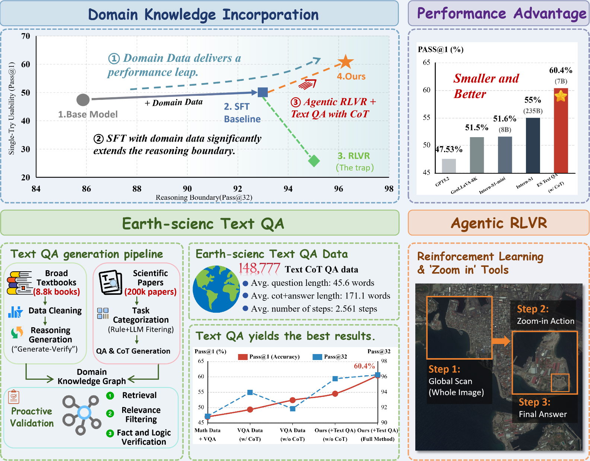
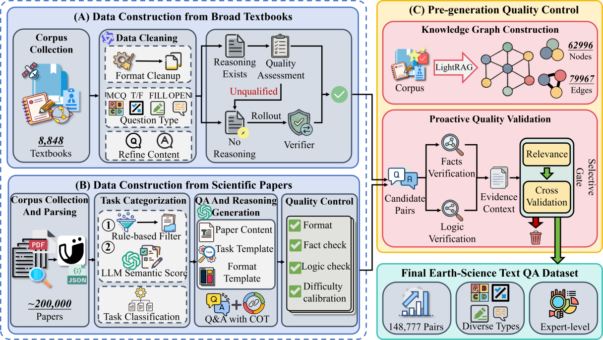

<div align="center">
  <h1><strong>Text Before Vision: Staged Knowledge Injection Matters for Agentic RLVR in UHR Remote Sensing</strong></h1>
  <p>
    <strong>Fengxiang Wang</strong><sup>1,2</sup>, 
    <strong>Mingshuo Chen</strong><sup>3</sup>, 
    <strong>Yueying Li</strong><sup>1</sup>, 
    <strong>Yajie Yang</strong><sup>4</sup>, 
    <strong>Yuhao Zhou</strong><sup>5</sup>
    <br>
    <strong>Di Wang</strong><sup>6,7</sup>, 
    <strong>Yifan Zhang</strong><sup>8</sup>, 
    <strong>Haoyu Wang</strong><sup>9</sup>, 
    <strong>Haiyan Zhao</strong><sup>9</sup>, 
    <strong>Hongda Sun</strong><sup>10</sup>
    <br>
    <strong>Long Lan</strong><sup>1</sup>, 
    <strong>Jun Song</strong><sup></sup>, 
    <strong>Yulin Wang</strong><sup>9*</sup>, 
    <strong>Jing Zhang</strong><sup>6*</sup>, 
    <strong>Wenlong Zhang</strong><sup>2*</sup>, 
    <strong>Bo Du</strong><sup>6</sup>
  </p>
  <p>
    <sup>1</sup>National University of Defense Technology, 
    <sup>2</sup>Shanghai AI Laboratory
    <br>
    <sup>3</sup>Beijing University of Posts and Telecommunications, 
    <sup>4</sup>University of the Chinese Academy of Sciences
    <br>
    <sup>5</sup>Sichuan University, 
    <sup>6</sup>Wuhan University, 
    <sup>7</sup>Zhongguancun Academy, 
    <sup>8</sup>Chinese Academy of Science
    <br>
    <sup>9</sup>Tsinghua University, 
    <sup>10</sup>Gaoling School of Artificial Intelligence, Renmin University of China
    </p> 
</div>
<div align="center">
  <a href="https://arxiv.org/abs/2601.00000"></a> 
    <a href="https://huggingface.co/datasets/initiacms/Text-Before-Vision"></a> 
    <a href="https://huggingface.co/initiacms/Text-Before-Vision"></a>
</div>


## 📚 Contents

- [📚Contents](#contents)
- [🔍Overview](#overview)
- [🌐Earth-Science Text QA Dataset](#earth-science-text-qa-dataset)
- [🛠️Methodology & Training](#methodology--training)
- [🚀Evaluation](#evaluation)
- [🤝Acknowledgement](#acknowledgement)

## 🔍Overview



<p align="center"><strong>Fig 1. The impact of domain data and staged training on UHR Remote Sensing Understanding.</strong></p>

We introduce a novel **Staged Knowledge Injection** framework for Ultra-High-Resolution (UHR) Remote Sensing (RS) understanding. While Agentic Reinforcement Learning with Verifiable Rewards (RLVR) offers a path for navigating massive pixel spaces, we find that standard RL struggles without structured domain priors.

Our controlled studies yield a counter-intuitive finding: **High-quality Earth-science text-only QA is a primary driver of UHR visual reasoning gains.** Based on this, we propose a "Text-Before-Vision" recipe that achieves a **60.04% Pass@1 on XLRS-Bench**, establishing a new state-of-the-art.

The key contributions are:

* **Mechanistic Insights**: We demonstrate that the reasoning boundary (Pass@32) in UHR tasks is primarily governed by domain-prior coverage. Text-only QA instills reasoning structures that facilitate visual evidence retrieval.
* **Earth-Science Text QA Pipeline**: We release an automated pipeline and a dataset of **148,777 high-quality Text CoT QA pairs**, constructed from 8.8k textbooks and 200k scientific papers, rigorously verified by a domain-specific Knowledge Graph.
* **Staged Knowledge Injection Recipe**: We propose a training strategy: (1) **Cold-starting** with text QA to instill reasoning structures, followed by (2) **"Pre-warming"** on hard UHR image-text examples during SFT to stabilize subsequent tool-based Agentic RLVR.

## 🌐Earth-Science Text QA Dataset

We construct a large-scale, domain-specialized text QA dataset using a fully automated pipeline with "Active Pre-emptive Validation." The data generation process (Fig 2) utilizes a Knowledge Graph (built via LightRAG) to filter hallucinations before generation.



<p align="center"><strong>Fig 2. Automated pipeline for Earth-science text QA generation and verification.</strong></p>

### Dataset Statistics

| Statistic | Value |
| :--- | :--- |
| **Total QA Pairs** | **148,777** |
| Avg. Question Length | 64.0 tokens |
| Avg. CoT + Answer Length | 256.9 tokens |
| Reasoning Steps (Avg) | 2.6 steps |
| Question Types | MCQ (24%), Fill (7%), T/F (4%), Free-form (65%) |

## 🛠️Methodology & Training

Our approach (Agentic RLVR) utilizes **Qwen2.5-VL** as the base model and integrates **GRPO** with zoom-in tools.

### 1. Prepare Data

* **Earth-Science Text QA**: Download our constructed dataset through [huggingface](https://huggingface.co/datasets/initiacms/Text-Before-Vision). 
* **SuperRS-VQA**: Ensure you have the [SuperRS-VQA](https://huggingface.co/datasets/initiacms/GeoLLaVA-Data) images for the SFT.
* **General RL Data**: We utilize [DeepEyes-47K](https://huggingface.co/datasets/ChenShawn/DeepEyes-Datasets-47k) for general reasoning stability.

### 2. Training Stages

We used a staged training process for Text-Before-Vision. Please check the `training` folder first.

#### Stage 1: Cold-Start SFT
We utilize LLaMA-Factory to perform SFT.

```bash
# 1. Download and prepare sft data from huggingface
# please make sure to modify the absolute image paths in SuperRS-VQA
# two json files are required here: geollava_superrs.json for SuperRS-VQA, text_148k_sft.json for text knowledge injection.
# 2. SFT using llamafactory
# We use this specific commit: https://github.com/hiyouga/LlamaFactory/tree/2a822178dea4d1c05f595521dd883a8e4f4e2e77
# if encountered TypeError duiring dataset preprocess, refer to https://github.com/hiyouga/LlamaFactory/issues/5613
# modify json paths in dataset_info.json and yaml file
llamafactory-cli train yamls/base.yaml
```

#### Stage 2: Agentic RLVR (with Tools)

Perform Group Relative Policy Optimization (GRPO) with zoom-in tools enabled. Here we utilize DeepEyes as the specific training framework.

```bash
# 1. first install DeepEyes through https://github.com/Visual-Agent/DeepEyes
# 2. download RL data, and modify parquet file paths in the training script
# there are 3 parquets from DeepEyes-47k and 1 parquet file from our HF repo
# 3. modify verl/utils/reward_score/__init__.py according to our provided __init__.py
# 4. follow deepeyes to set LLM judge and start training through:
bash train_rq_general.sh
```

## 🚀Evaluation

We evaluate primarily on **XLRS-Bench** to measure both average performance (Pass@1) and reasoning boundary (Pass@32).

### Evaluation Steps

To replicate the results in our paper:

```bash
# 0. execute the prepare_xlrs_data.ipynb to preprocess the evaluation data
# 1. convert model from pt format to hf model
bash s1.sh
# 2. deploy model using vllm (or ray using `serve run ray.yaml`)
bash s21.sh
# 3. prompting vllm, this may take 1~2 days for pass@32 evaluation
bash s22.sh
# 4. calculate metrics
bash s232.sh
```

### Expected Results

We also provide our trained model checkpoints [here](https://huggingface.co/initiacms/Text-Before-Vision).

| Method | Pass@1 | Pass@32 |
| --- | --- | --- |
| Baseline (RLVR) | 50.01 | 82.58 |
| + Pre-warming (SuperRS-VQA) | 52.39 | 91.85 |
| **+ Text Cold Start (Ours)** | **60.40** | **96.25** |

# 🤝Acknowledgement

This repo benefits from [DeepEyes](https://github.com/Visual-Agent/DeepEyes) and [LLaMA-Factory](https://github.com/hiyouga/LlamaFactory). Thanks for their wonderful works.

